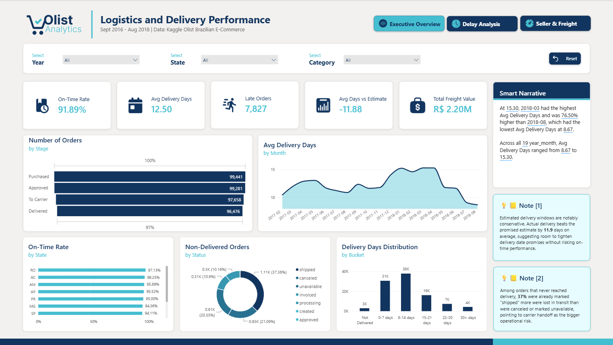
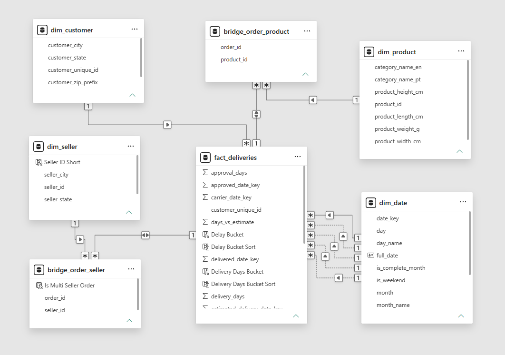
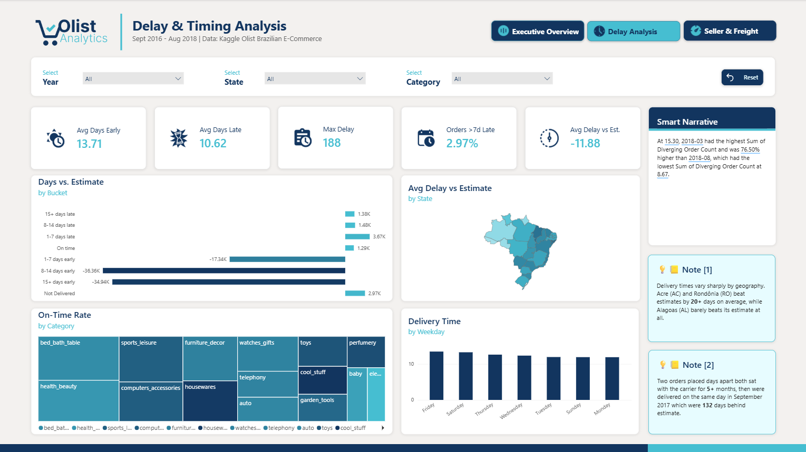
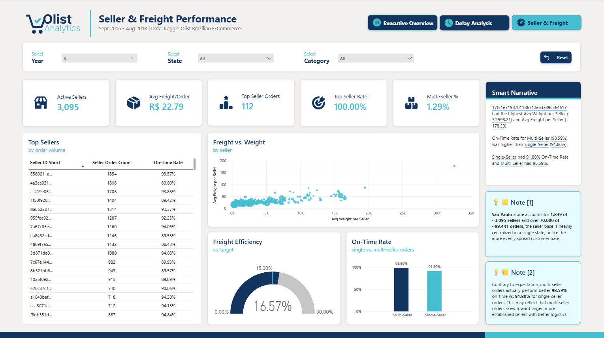

# Olist E-Commerce — Logistics & Delivery Performance Dashboard

A 3-page Power BI dashboard analyzing delivery timing, delay patterns, and seller/freight performance for Olist, a Brazilian multi-vendor e-commerce marketplace. Built end-to-end from raw CSVs — data cleaning, star schema design, DAX modeling, and dashboard design. Second in a 3-part portfolio series on the Olist dataset ([Part 1: Sales & Revenue Performance](https://github.com/siamsadman/olist-sales-dashboard)).

**[.pbix Download ▸](https://github.com/siamsadman/olist-logistics-dashboard/blob/main/dashboard/olist_logistics_dashboard.pbix)**

> **About this project:** I'm a BI Developer and Reporting Analyst with 12+ years building automated reporting pipelines and Power BI dashboards in production, for clients including British American Tobacco Bangladesh, Arnott's Australia, and TOLL Australia. This project is a from-scratch demonstration of that same end-to-end process on a public dataset — raw data with real quality problems, a fully modeled star schema, and dashboards, with every DAX measure validated against independent SQL. Documented the way I'd document a production deliverable.
>
> Microsoft certified: DP-600 (Fabric Analytics Engineer Associate), PL-300 (Power BI Data Analyst Associate).
>
> [Connect on LinkedIn](https://www.linkedin.com/in/siam-sadman)



---

## Why This Dataset

Same dataset as Part 1 of this series ([Olist Brazilian E-Commerce](https://www.kaggle.com/datasets/olistbr/brazilian-ecommerce)), different business angle. Where Part 1 asked "how is the business performing," this project asks "how well is the business fulfilling its promises to customers" — a deliberately different analytical lens on the same underlying data, to demonstrate that the same dataset can support genuinely distinct business questions depending on which tables and grains you center the model around.

---

## Tech Stack

- **SQL Server** (Dockerized) — staging, transformation, star schema
- **Python (pandas)** — initial data cleaning (null handling, placeholder values)
- **Power BI Desktop** — data modeling, DAX, dashboard design
- **Navicat Premium** — database administration, CSV import

---

## Data Model

A star schema centered on a new order-grain fact table, reusing the shared dimensions (`dim_date`, `dim_customer`, `dim_seller`, `dim_product`) from Part 1's model without modifying any of Part 1's existing tables.



**Fact table:**
- `fact_deliveries` — grain: one row per order. Carries five role-playing date keys (purchase, approved, carrier handoff, delivered, estimated delivery), aggregated freight value, and pre-computed delay/timing measures.

**Bridge tables:**
- `bridge_order_seller` — resolves the many-to-many between orders and sellers (an order can include items from more than one seller)
- `bridge_order_product` — resolves the many-to-many between orders and product categories

**Dimensions (reused from Part 1, unmodified):** `dim_date`, `dim_customer`, `dim_seller`, `dim_product`

### Why bridge tables instead of a direct relationship

An order in this dataset can legitimately involve more than one seller or span more than one product category. Forcing a single seller or category onto each order row would silently misrepresent roughly 1.3% of orders (the ones that genuinely span multiple sellers) and undercount category-level performance. Two lightweight bridge tables (`order_id` + `seller_id`, `order_id` + `product_id`) let both relationships resolve correctly as two clean many-to-one hops instead of one messy many-to-many.

### Why a new fact table instead of extending `dim_order`

Part 1's `dim_order` already exists at one-row-per-order grain, which made it tempting to just add delivery columns there. I deliberately built `fact_deliveries` as a fully separate table instead, so nothing in this project could accidentally alter a table Part 1's published dashboard depends on. Same principle applied to the source data: rather than updating `stg_orders` in place, I duplicated it to `stg_orders_logistics` before cleaning it, so Part 1's data pipeline remains completely untouched.

---

## Data Quality: What I Found and How I Handled It

| Issue Found | Resolution |
|---|---|
| `data_cleaning.py` (from Part 1) filled missing delivery timestamps with a placeholder `1900-01-01` instead of leaving them null | Rewrote the cleaning script to convert these columns with `pd.to_datetime(errors='coerce')`, producing true nulls; separately patched the already-loaded staging table with `UPDATE ... SET ... = NULL` |
| 2,965 orders have no `order_delivered_customer_date` (never confirmed delivered) | Confirmed as expected — largely explained by a visible drop-off between carrier handoff and delivery (1,182 of the 2,965), not by cancellations |
| `dim_date` (built in Part 1) only covered the purchase-date range and didn't extend far enough to cover `order_estimated_delivery_date`, which projects up to 26 days past the last purchase date | Extended `dim_date` with the missing date range only — no existing rows touched |
| Two bridge table relationships (`bridge_order_seller`, `bridge_order_product`) defaulted to single-direction cross-filtering, silently preventing category/seller-level filters from reaching `fact_deliveries` | Changed both relationships to bidirectional cross-filtering in the model |
| A small number of orders show extreme delivery delays (up to 132 days past estimate) | Verified against raw timestamps rather than assumed to be bad data — confirmed as a real event (two unrelated orders both cleared in an apparent batch resolution in Sept 2017), not a data error |
| 59% of sellers (1,824 of 3,095) have fulfilled fewer than 10 orders | Applied a minimum sample size threshold (≥30 orders) before including a seller in any ranking measure, to avoid a tiny-sample seller producing a misleadingly perfect or terrible rate |

---

## Key Modeling Decisions

**Minimum sample size for seller rankings.** Any "top seller" measure requires at least 30 resolved orders before a seller qualifies — without this, a seller with 2 orders and a lucky outcome could show a meaningless 100% rate. This is the same discipline applied to the state-loyalty threshold in Part 1, scaled down to fit the seller-level order distribution here.

**Blank-safe rate calculations.** Every rate measure (on-time rate, delay averages) explicitly excludes rows where the outcome is still unresolved (`is_late` is blank, meaning the order was never confirmed delivered), rather than letting DAX's default blank-handling silently include or exclude them. An early version of the on-time rate measure that didn't do this returned 95% instead of the correct 91.9% — a 3-point error that would have overstated performance on a published dashboard.

**Role-playing date dimension.** `fact_deliveries` relates to `dim_date` five separate times (purchase, approved, carrier, delivered, estimated). Only the purchase-date relationship is active by default, matching Part 1's convention; the other four are invoked explicitly with `USERELATIONSHIP()` wherever a measure needs to pivot onto a different date stage.

**Trend visuals exclude statistically thin months.** Delivery-time trends are filtered to Feb 2017–Aug 2018. Outside that range, monthly order counts drop below 300 (compared to 5,000–8,000 in a typical month), which let a handful of orders swing the average enough to produce a misleading spike at both ends of the raw date range.

---

## Dashboard Pages

### 1. Executive Overview
Top-line delivery KPIs, an order-stage funnel, delivery-time trend, and on-time rate by state — the 30-second summary of how reliably Olist delivers.


### 2. Delay & Timing Analysis
A deeper look at when and where delays happen — delay distribution, a delay-by-state map, on-time rate by product category, and delivery time by day of week.



### 3. Seller & Freight Performance
Seller-level reliability and freight cost analysis, including a freight-vs-weight comparison across sellers and a direct test of whether multi-seller orders perform worse than single-seller ones.



All three pages share a synced filter panel (Year, State, Category) and include both auto-generated statistical highlights (Power BI Smart Narrative) and hand-authored analyst takeaways.

---

## Notable Findings

- **Delivery beats the promised estimate by 11.9 days on average.** Olist's estimated delivery windows are notably conservative — actual delivery consistently arrives well ahead of what's promised to the customer, suggesting room to tighten delivery-date estimates without risking on-time performance.
- **Delivery times follow a clear seasonal pattern.** Times peaked above 15 days during the Nov 2017–Feb 2018 holiday period, then improved steadily to a low of ~9 days by August 2018.
- **The seller base is heavily centralized.** São Paulo alone accounts for 1,849 of ~3,095 sellers and over 70,000 of ~99,441 orders — a far more concentrated distribution than the customer base, which is spread more evenly across states.
- **Multi-seller orders outperform single-seller orders.** Contrary to the intuitive assumption that splitting an order across sellers would hurt coordination and timing, multi-seller orders show a *higher* on-time rate (98.6%) than single-seller orders (91.8%) — likely because multi-seller orders skew toward larger, more established sellers with better logistics.
- **Among orders that never reached delivery, more were lost in transit than were canceled.** 37% of non-delivered orders were already marked "shipped," a larger share than "canceled" (21%) or "unavailable" (21%) — pointing to carrier handoff, not customer cancellation, as the bigger operational risk.

---

## Repository Structure

```
/olist-logistics-dashboard
├── README.md
├── sql/
│   ├── 00_staging_prep.sql    — duplicates stg_orders, fixes placeholder dates
│   ├── 01_schema.sql          — fact_deliveries + bridge table DDL
│   ├── 02_dim_date_extend.sql — dim_date range extension
│   └── 03_load_facts.sql      — fact/bridge table population scripts
├── scripts/
│   └── data_cleaning.py       — corrected data cleaning (no placeholder dates)
├── dashboard/
│   └── olist_logistics_dashboard.pbix
├── images/
│   ├── page1_executive_overview.png
│   ├── page2_delay_timing_analysis.png
│   ├── page3_seller_freight_performance.png
│   └── data_model.png
```

---

## About

Built by Siam Sadman as part of a portfolio project.

[www.linkedin.com/in/siam-sadman](http://www.linkedin.com/in/siam-sadman)
